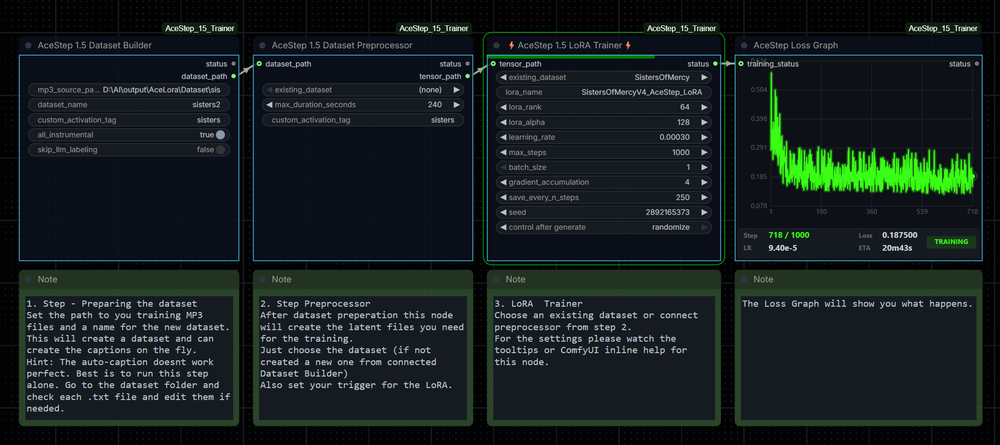

# ⭐SN ComfyUI AceStep 1.5 LoRA Trainer

**Version 1.0 (Beta)** — Train audio LoRAs for [ACE-Step 1.5](https://github.com/ace-step/ACE-Step-1.5) directly inside ComfyUI.

> ⚠️ **Beta Software** — This project is in beta. It is functional and tested, but may contain bugs or rough edges. **No support is provided.** Use at your own risk.
>
> If you find this useful, please ⭐ **star the repo** — it helps a lot! Pull requests and issue reports are welcome.

Four nodes guide you through the full pipeline: build a dataset, preprocess it, train a LoRA, and visualize the training loss in real-time — all without leaving ComfyUI.



## Features

- **One-click dataset building** from your MP3/WAV/FLAC/OGG/Opus files
- **Automatic audio labeling** with selectable ACE-Step 5Hz LLM (0.6B / 1.7B / 4B)
- **Editable `.txt` metadata** files so you stay in control of captions, BPM, key, lyrics
- **GPU-accelerated preprocessing** (VAE + text encoder + DiT condition encoder)
- **Flow-matching LoRA training** on the DiT decoder with PEFT
- **Real-time loss graph** with dark neon aesthetic via WebSocket
- **Pause & resume training** — checkpoint saves include full optimizer state
- **Periodic checkpoint saving** so you can stop early and still use partial results
- **Single-file `.safetensors` output** compatible with ACE-Step inference nodes
- **Auto-downloads all models** from HuggingFace on first use (~7 GB total)
- Works on **Windows** and **Linux**

## Nodes

| Node | Purpose |
|------|---------|
| **⭐SN AceStep 1.5 Dataset Builder (Beta)** | Scans audio files, copies them to a dataset folder, auto-labels with LLM |
| **⭐SN AceStep 1.5 Dataset Preprocessor (Beta)** | Encodes audio + text into `.pt` tensor files for training |
| **⭐SN AceStep 1.5 LoRA Trainer (Beta)** | Trains LoRA adapters on the DiT decoder, saves `.safetensors` checkpoints |
| **⭐SN AceStep Loss Graph (Beta)** | Real-time training loss visualization (connects to Trainer) |

## Installation

### Manual (recommended)

```bash
cd ComfyUI/custom_nodes
git clone https://github.com/StarNodes/ComfyUI-AceStep_15_Trainer.git
cd ComfyUI-AceStep_15_Trainer
pip install -r requirements.txt
```

Restart ComfyUI. The four nodes will appear under the **AceStep** category.

> **Note:** If you use ComfyUI's portable/embedded Python, run `pip install` from within that environment:
> ```bash
> path/to/ComfyUI/python_embeded/python.exe -m pip install -r requirements.txt
> ```

## Workflow

```
[Your Audio Folder] → Dataset Builder → (edit .txt files) → Preprocessor → Trainer → my_lora.safetensors
                                                                              ↓
                                                                         Loss Graph
```

### Step 1: Dataset Builder
1. Point `mp3_source_path` to a folder with your audio files
2. Give the dataset a name
3. Optionally add a custom activation tag (e.g. `mystyle`)
4. Choose the LLM model for auto-labeling (0.6B / 1.7B / 4B)
5. Run — audio files are copied and `.txt` metadata files are generated

### Step 2: Edit Metadata (optional)
Open the `.txt` files in `output/AceLora/Dataset/{name}/` and refine captions, lyrics, BPM, key, etc.

### Step 3: Preprocessor
1. Select your dataset (or connect from Step 1)
2. Run — each audio+txt pair is encoded into a `.pt` tensor file

### Step 4: Trainer
1. Select the preprocessed dataset
2. Configure LoRA rank, learning rate, epochs, etc.
3. Optionally select a checkpoint to resume from
4. Run — training blocks the node and logs progress to the CMD console
5. Connect the **⭐SN AceStep Loss Graph (Beta)** node to see real-time loss visualization
6. Checkpoints are saved at intervals: `my_lora_250steps.safetensors` + `my_lora_250steps_checkpoint.pt`
7. Final result: `my_lora_final.safetensors`
8. The **Loss Graph** node shows the final LoRA save path when training finishes

### Epochs vs Steps

The trainer uses **epochs** (full dataset passes) as input. Steps are calculated automatically:
- **Epoch** = one full pass through all your audio samples
- **Step** = one optimizer weight update (processes `batch_size x gradient_accumulation` samples)
- **Steps per epoch** = `ceil(samples / batch_size) / gradient_accumulation`
- The **Loss Graph** displays individual steps for fine-grained monitoring

For example: 10 samples, batch=1, grad_accum=4 → ~3 steps/epoch. Setting epochs=100 gives ~300 total steps.

### Resume Training
Training can be paused and resumed:
1. Train with `save_every_n_epochs=10` — checkpoint `.pt` files are saved alongside LoRA weights
2. Later: select a checkpoint from the `resume_from_checkpoint` dropdown
3. Training continues from the saved step with the same optimizer state, LR schedule, and RNG

## Models (auto-downloaded)

All models are downloaded automatically from [HuggingFace](https://huggingface.co/ACE-Step) on first use and stored in `ComfyUI/models/AceStep/`:

| Component | Size | HuggingFace Source |
|-----------|------|--------------------|
| VAE (AutoencoderOobleck) | ~300 MB | [ACE-Step/Ace-Step1.5](https://huggingface.co/ACE-Step/Ace-Step1.5) |
| Text Encoder (Qwen3-Embedding-0.6B) | ~1.2 GB | [ACE-Step/Ace-Step1.5](https://huggingface.co/ACE-Step/Ace-Step1.5) |
| LLM 1.7B (default, auto-labeling) | ~3.4 GB | [ACE-Step/Ace-Step1.5](https://huggingface.co/ACE-Step/Ace-Step1.5) |
| LLM 0.6B (lighter alternative) | ~1.2 GB | [ACE-Step/acestep-5Hz-lm-0.6B](https://huggingface.co/ACE-Step/acestep-5Hz-lm-0.6B) |
| LLM 4B (highest quality labels) | ~8 GB | [ACE-Step/acestep-5Hz-lm-4B](https://huggingface.co/ACE-Step/acestep-5Hz-lm-4B) |
| DiT Default (labeling/tokenization) | ~4.5 GB | [ACE-Step/Ace-Step1.5](https://huggingface.co/ACE-Step/Ace-Step1.5) |
| DiT Turbo shift3 (training target) | ~2 GB | [ACE-Step/acestep-v15-turbo-shift3](https://huggingface.co/ACE-Step/acestep-v15-turbo-shift3) |

Models are stored as real files (no symlinks), so they survive HuggingFace cache cleanups.

## Directory Structure

```
ComfyUI/
├── models/AceStep/                          # Auto-downloaded models
│   ├── vae/
│   ├── Qwen3-Embedding-0.6B/
│   ├── acestep-5Hz-lm-1.7B/
│   ├── acestep-v15-turbo/
│   └── acestep-v15-turbo-shift3/
└── output/AceLora/
    ├── Dataset/{name}/                      # Your datasets
    │   ├── song1.mp3
    │   ├── song1.txt                        # Editable metadata
    │   └── tensors/                         # Preprocessed .pt files
    │       └── song1.pt
    └── Trained/{name}/                      # Trained LoRA outputs
        ├── my_lora_250steps.safetensors     # Inference-ready LoRA
        ├── my_lora_250steps_checkpoint.pt   # Training state (for resume)
        ├── my_lora_500steps.safetensors
        ├── my_lora_500steps_checkpoint.pt
        └── my_lora_final.safetensors
```

## Training Tips

- **Small datasets (3–10 files)**: Use rank 32–64, 100–200 epochs, LR 1e-4
- **Medium datasets (10–50 files)**: Use rank 64–128, 50–100 epochs, LR 5e-5
- **Gradient accumulation**: Increase to 8–16 for more stable training with small batches
- **Save frequently**: Set `save_every_n_epochs` to 10–25 so you can test early checkpoints
- **Activation tags**: Use a unique tag like `mystyle` so the LoRA only activates when you want it
- **Watch the loss graph**: Loss should steadily decrease. If it spikes, lower the learning rate.

## Using Your Trained LoRA

The output `.safetensors` files are compatible with any ACE-Step ComfyUI inference node pack:
1. Copy your `my_lora_final.safetensors` to the LoRA path expected by your ACE-Step node pack
2. Use the LoRA loading option and select your trained file
3. If you used an activation tag, include it in your prompt
4. Adjust LoRA strength (0.0–1.0) to control the effect

## Requirements

- Python 3.10+
- PyTorch with CUDA support
- ~8 GB VRAM minimum (16 GB recommended)
- Dependencies: `peft`, `transformers`, `diffusers`, `huggingface_hub`, `torchaudio`, `soundfile`, `safetensors`, `pyyaml`

## Credits & Acknowledgments

This project is built on top of the [ACE-Step 1.5](https://github.com/ace-step/ACE-Step-1.5) music generation model by the ACE-Step team. All model weights are sourced from their official [HuggingFace organization](https://huggingface.co/ACE-Step).

- **ACE-Step 1.5**: [https://github.com/ace-step/ACE-Step-1.5](https://github.com/ace-step/ACE-Step-1.5)
- **HuggingFace Models**: [https://huggingface.co/ACE-Step](https://huggingface.co/ACE-Step)

We are grateful to the ACE-Step team for making their model and weights publicly available.

## Disclaimer

This is a **beta release**. The software is provided as-is with **no warranty and no support**. While we've tested it extensively, unexpected issues may occur depending on your hardware, ComfyUI version, or dataset.

- ⭐ **Star this repo** if you find it useful
- 🐛 **Open an issue** if you find a bug (no guarantee of a fix, but we appreciate reports)
- 🚀 **Pull requests** are welcome for improvements and fixes

## License

This project is licensed under the [MIT License](LICENSE). See the LICENSE file for details.

The ACE-Step model weights are subject to their own license terms — please refer to the [ACE-Step repository](https://github.com/ace-step/ACE-Step-1.5) for details.
